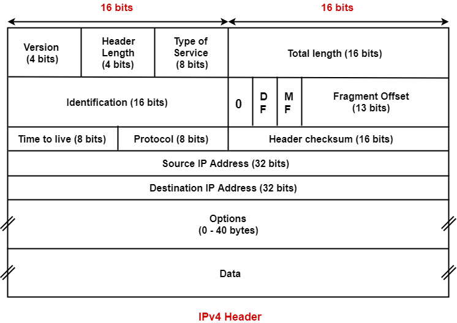

# Learning goal

- Describe the general information contained in packet headers and the role of this information

#### A.IPv4
- Describe IP protocol header and the purpose of the fields.
- Understand how and why the IPv6 header is different from IPv4
- Explain how organizations gets IP addresses for its use.
- Define what is meant by a non-routable IP address.
- Describe the structure of IPv4 addresses and the CIDR addressing, masks for assigning the network/host
- Given a CIDR address determine the range of IP addresses it covers.
- Given a range of addresses determine an appropriate CIDR representation
- Describe the relationship between IP addresses and routing in the Internet
- Perform longest prefix matching
- Given a router, its routing tables and an incoming packet determine the link the packet will go out on
- Given a collection of routers, their routing tables, and a packet trace the packet through the network

###  IPv4 Datagram Format



#### Version number
- 4 bits specify the IP protocol version of the datagram
- **Router** determine how to **interpret** the remainder of OP datagram by this

#### Header length
- 4 bits
- Determine where in the **IP datagram** the payload **actually begin**

#### Type of service
- TOS were included in IPv4 header
- Allow different type of IP datagram to be distinguished from each other
(eg distinguished real-time or non-realtime traffic)

#### Datagram length
- total **length of the IP datagram** (header + data)
- measured by bites
- 16 bites long

#### Identifier, flags, fragmentation offset.
- new version IP, IPv6 does not allow for fragmentation

#### Time-to-live(TTL)
- ensure datagrams do not circulate forever in the net work
- Decremented by one each time
- processed by router
- Reach 0, router must drop datagram

#### Protocol
- used in IP datagram reach destination.
- The value indicate specific transport-layer protocol where data portion in IP datagram should be pass

#### Header checksum
- Helps router in detecting bit errors in received IP datagram
- each header checksum need to **recomputed again** at each router

Why does TCP/UP perform error checking at both the transport and network layers?

```text
- Only IP header is checksummed at the IP layers while TCP/UDP checksum is computed over the entire TCP/UDP segment
-  TCP/UDP and IP not necessarily both have to belong to same protocal stack
```

#### Source and destination IP addresses
- insert IP address into source IP address

#### Options
- allow an IP header to be extended

#### Data(Payload)
- IP datagram contains the transport-layer segment tobe del,ivered to the destination
- Also can carry other data like ICMP messages

### IPv4 addressing

**Interface**

- **Boundary** between the *host* and the *physical link* is called **interface**.
- **router** is for collect datagram from one link and forward the datagram on some other link, **More than 2 link** for router is **necessary.**
-  **Boundary** between the *router* and the *other link* is called **interface**
- **A router has multiple interface, one for each link**
- **IP** requires each *host and router interface* to have its own **IP address.**
- *IP address is technically associated with an interface, rather than with the host or router containing that interface*

- Each IP address is typically written in so-called **dotted-decimal notation.**

**Subnet**
- network interconnecting 3 host interfaces and 1 router interface, forms a **subnet**
- Subnet no restricted to Ethernet segments that connect multiple hosts to a router interface.
- A subnet stand for sub-network. It is like a small network within a large network.

```text
Example for subnet:
You have router connected to the internet and one of its interface is connected to a WIFI router. This WIFI router is on a subnet of the router that is connected to the internet.

```

How to create **Subnet**

```text
To determining the subnets, detach each interface from its host or router, creating islands of isolated networks, with interfaces terminating the end points of the isolated networks.
```

What is Host?

```text

```

- Each interface create its own **Isolated networks**, and terminating end of each isolated network.

**CIDR(Classless Interdomain Routing)**

- CIDR generalizes the notion of subnet addressing
- 32-bits IP address is divided into 2 parts, and again has the dotted-decimal form a.b.c.d/x.
- x indicates the number of bits in the first part of the address.
- （32-x） of bits indicate specific hosts in the organization

**Perform longest prefix match**

- Convert the advertised address to binary
- Strip off bits pass the x bits
- Always a default 0.0.0.0 that matches everything
- See how many bits of the prefix match the destination IP (use a MASK with prefix 1’s and AND)

# Learning goal

#### B. BGP

- Define the purpose of an AS

- Explain how routing decisions are made from the perspective of the AS

- List the the types of information exchanged by eBGP

- Given multiple routes to a destination enumerate the factors that go into the router's decision to route a particular way.

- Understand the terminology related to IGP, EGP, iBGP, eBGP, BGP connection, peering, transit, border, exchange point.  OSPF (just as an example of an IGP).

- Aggregation or summarization of CIDR addresses to reduce routing table size.

### Intra-AS Routing in the Internet: OSPF

Every router by using same routing algorithm, Reason
- **Scale**, too many routers, loading too many memory. Reduce the complexity of route computation in a network.

- **Administrative autonomy**,ISP has its own network routers that under same administrative control.

**Purpose of ASs**
*An AS is a connected IP routing prefixes under the control of one or more network operators on behalf of a single administrative entity. Each AS has a unique ASN.*


**Intra-autonomous system routing protocol**
Routers within the same AS all run the same routing algorithm and have information about each other.

#### Explain how routing decisions are made from the perspective of the AS
- Routing within a single AS
- Routing between different AS

### Routing Among the ISPs: BGP

As an inter-AS routing protocol, BGP provides each router a means to:
```text
- Obtain prefix reachability information from neighboring ASs.
- Determinie the "best" routes to the prefixes.
```

#### Advertising BGP Route Information
- Each AS, each router is either a **gateway router** or an **internal router.**

Gateway router : router on the edge of an AS that directly connects to one or more routers in other ASs.

Internal router: connects only to hosts and routers within its own ASs

- Each BGP routers exchange routing information over semipermanent TCP connections usng port 179, BGP connections.
- BGP connection that **spans two ASs** is called an **external GBP(eBGP)** connection
- BGP connection in same ASs, called internal BGP (iBGP)

#### List the types of information exchanged by eBGP
- 	AS path vector
-   DST network
- 	Next_Hop: IP address of interface that begins the AS path

#### Determining the Best routes

##### Hot Potato Routing
selffish algorithm- it tries to reduce the cost in its own AS while ignoring the other components of the end-to-end cost outside its AS.

##### Route-Selection Algorithm
If there are two or more routes to same prefix, then BGP sequentially invokes the following elimination rules until one route remains:

```text
- A route is assigned a local preference value as one of its attributes
- From remaining routes, the route with shortest AS-PATH is selected.(using DV algorithm)
- From remaining routes, hot potato routing is used. with closest NEXT-HOP router is selected
- If more than one route still remains , the router uses BGP identifiers to select the route
```

##### Routing Policy
